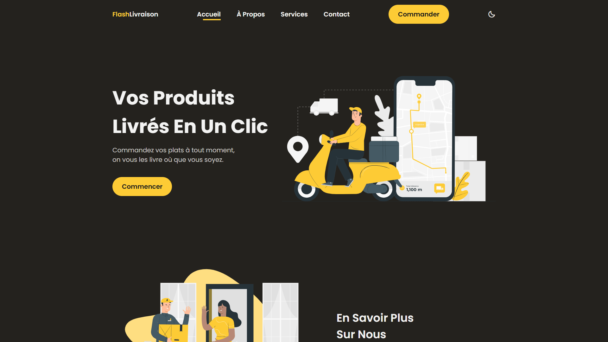

<div align="center">  
    <a href="https://delivery-service-vm.netlify.app/" target="_blank">  
        
    </a>
    </br>  
    </br>  
  <h3 align="center">⚡ Flash Livraison &nbsp; — &nbsp; Service de Livraison</h3>  
</div>

## <br /> 📌 Sommaire

&nbsp;&nbsp;&nbsp; 🎨 &nbsp; [**Introduction**](#introduction)<br />
&nbsp;&nbsp;&nbsp; 🛠️ &nbsp; [**Technologies**](#technologies)<br />
&nbsp;&nbsp;&nbsp; 🎯 &nbsp; [**Fonctionnalités**](#fonctionnalités)<br />
&nbsp;&nbsp;&nbsp; 🚀 &nbsp; [**Installation**](#installation)<br />

## <br /> <a name="introduction">🎨 Introduction</a>

Flash Livraison est une landing page moderne et responsive pour un service de livraison rapide. Intégrant des illustrations SVG dynamiques, un mode sombre et clair, des animations au scroll et une navigation mobile fluide, ce projet combine design et performance pour une expérience utilisateur optimale.

## <br /> <a name="technologies">🛠️ Technologies</a>

- HTML5 sémantique et structuration claire
- CSS3 moderne avec variables, media queries et animations
- JavaScript ES6 clair et modulaire
- [ScrollReveal](https://scrollrevealjs.org/) pour des animations au scroll
- [Boxicons](https://boxicons.com/) pour des icônes vectorielles modernes
- Responsive Design pensé en mobile-first

## <br /> <a name="fonctionnalités">🎯 Fonctionnalités</a>

- Changement de thème avec persistance locale
- Menu mobile animé avec ouverture et fermeture
- Injections d’illustrations SVG au scroll
- Section services avec blocs interactifs
- Section contact complète adresse, téléphone et email
- Call-to-action vers le téléchargement de l’app
- Footer structuré : services, entreprise, communauté, réseaux
- Bouton de retour accueil dynamique au scroll
- Lien actif de navigation mis à jour automatiquement
- Design adaptatif pensé mobile-first
- Thème coloré basé sur variables CSS

## <br /> <a name="installation">🚀 Installation</a>

### ✅ Prérequis

- [Google Chrome](https://www.google.com/) &nbsp;—&nbsp; Navigateur moderne
- [Visual Studio Code](https://code.visualstudio.com/) &nbsp;—&nbsp; Éditeur de code
- [Live Server](https://marketplace.visualstudio.com/items?itemName=ritwickdey.LiveServer) &nbsp;—&nbsp; Extension VS Code

### 📥 Cloner le projet

```bash
git clone git@github.com:ValentinMadiot/delivery-service_ui
cd delivery-service_ui
```

### ▶️ Lancer le projet

Il suffit d’ouvrir le fichier `index.html` dans un navigateur, ou d’utiliser l’extension **Live Server** sur VS Code pour un aperçu dynamique.
